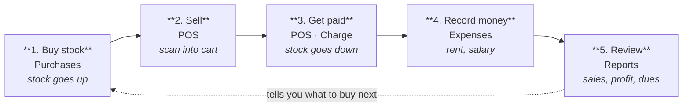

# MPoS — Quick User Manual

*Point of Sale & Inventory — single-store edition.*

How the shop runs, start to finish. **Set it up once, then repeat one simple loop
every day:** buy stock → sell it → get paid → check the numbers.

Menu paths below are written as they appear in the sidebar, with the screen's
address in `code` (e.g. `/settings`).

---

## 1. First-time setup (do this once, as an Admin)

Work top to bottom.

| # | Step | Where | Example |
|---|------|-------|---------|
| 1 | **Enter your shop details** — name, address, phone (these print on every receipt); set the loyalty rule. | `Admin › Settings` — `/settings` | Name it "Zephyr & Co.", add the address & phone, set "every ৳100 spent = 10 points". |
| 2 | **Build your lists** — the blocks a product is made of. | `Catalogue › Categories · Brands · Units · Attributes` — `/categories`, `/brands`, `/units`, `/attributes` | Add category `T-Shirts`, brand `Zephyr`, unit `Piece`, size `S, M, L`, colour `Red, Navy`. |
| 3 | **Add your products** — pick sizes & colours and the variants generate themselves, each barcoded. | `Catalogue › Products › New` — `/products/new` | Add "Classic Tee", tick `S/M/L` × `Red/Navy` → **6 variants** (S/Red … L/Navy) appear. |
| 4 | **Add your people** — suppliers you buy from, and (optionally) regular customers. A "Walk-in" already exists. | `Buying › Suppliers` · `Customers` — `/suppliers`, `/customers` | Add supplier "Rahim Traders"; add "Karim Mia" to the **Gold** group (auto 10% off). |
| 5 | **Create logins** — one per person; each is an Admin or a Cashier. | `Admin › Users & roles` — `/users` | Create login "cashier" set to **Cashier** — cost & profit stay hidden from them. |

---

## 2. The daily loop — what comes after what

This is the whole job. Each step feeds the next.

| # | Step | Where | Example |
|---|------|-------|---------|
| 1 | **Buy stock** — record what arrives from a supplier. Stock goes **up**. | `Buying › Purchases` — `/purchases/new` | Buy `20 × Classic Tee S/Red @ ৳5` from Rahim Traders, pay cash → on-hand 0 → 20. |
| 2 | **Sell** — scan or tap products into the cart, pick the customer. | `POS` — `/pos` | Scan the S/Red barcode → it drops into the cart; choose customer Karim Mia. |
| 3 | **Get paid** — take cash / points, give change, print the receipt. Stock goes **down**. | `POS › Charge` — `/pos` | 1 tee ৳45, Gold 10% off → **৳40.50**; take ৳50 → ৳9.50 change; receipt prints, points added. |
| 4 | **Record money** — log rent, salary & bills so profit stays honest. | `Money › Expenses` — `/expenses` | Add expense "Rent ৳25,000" paid from Cash → shows in Profit & Loss, cash drops. |
| 5 | **Review** — see sales, profit and who owes you, for any date range. | `Reports` — `/reports` | Open Reports → pick `This month` → read net sales, gross profit and dues. |

**↻ Reports tell you what to buy next — and the loop starts again.**

---

## 3. Handling the counter (when it isn't a plain sale)

Three things happen at a real counter. Each has its own screen.

**A customer brings goods back**
`Selling › Sale returns` (`/sale-returns`) → pick the sale → choose items → refund cash **or** credit account.
> *e.g.* Karim returns 1 of 3 tees → 1 goes back on the shelf, and his account is credited **what he actually paid** (not the tag price).

**A customer swaps a size or item**
`POS › Exchange` (`/pos`) → find the invoice → take back the old → add the new → pay any difference.
> *e.g.* Swap `S/Red` for `M/Red` (same price) → even swap, **no cash** changes hands. See it in `Selling › Exchanges` (`/exchanges`).

**Stock is damaged or the count is wrong**
`Stock › Adjustments` (`/adjustments`) → pick the item → type the real count.
> *e.g.* Canvas Cap counted `22` but system says `20` → type 22, stock corrects (+2 found). Faulty goods instead go back via `Buying › Purchase returns` (`/purchase-returns`).

---

## 4. What each menu section does

| Section | Screens |
|---|---|
| **Home** | **Dashboard** — today at a glance · **POS** — the till |
| **Catalogue** | **Products** · **Categories / Brands / Units** · **Attributes & colours** (sizes, colours) · **Labels** (print barcodes) |
| **Buying** | **Purchases** (stock in) · **Purchase returns** · **Suppliers** (+ dues) |
| **Selling** | **Sales** (every invoice) · **Sale returns** · **Exchanges** |
| **Stock** | **Inventory** (on hand) · **Adjustments** (fix counts / write-offs) |
| **Customers** | **Customers** (+ ledger) · **Customer groups** (discount tiers) |
| **Money** | **Accounts** (cash & bank) · **Expenses** · **Employees & salary** |
| **Reports** | **Overview** · **Sales** · **Profit & Loss** · **Product profit** · **Dues** |
| **Admin** | **Users & roles** · **Activity log** · **Settings** |

---

## 5. Who sees what

- **Admin** — everything: products, purchases, money, reports **with cost & profit**, settings and other users.
- **Cashier** — sells at the POS and handles returns. Cost, profit, expenses and settings stay hidden.

---

## 6. Four things the system always does (so the numbers can be trusted)

- **Stock** — quantities move **only** through purchases, sales, returns and adjustments; never typed in by hand.
- **Cash** — every payment lands in an account, so the drawer and the reports always agree.
- **Live** — reports read the real data; what you enter today shows up today.
- **Price** — the best single discount applies (never stacked), and a product's minimum price is a hard floor.
